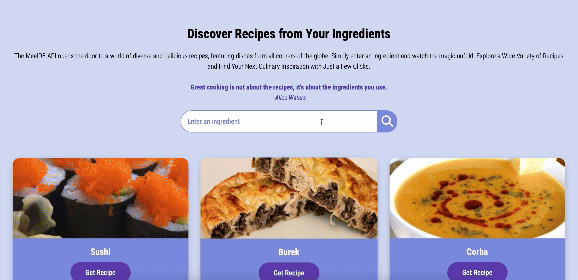

## Recipe Search API https://recipe-search-api15012005.web.app

The purpose of this project is to practice working with JavaScript, CSS, the MealDB API and Firebase.

This website allows users to search for recipes based on specific ingredients. It uses the MealDB API, which provides a rich collection of meals from around the world. Simply enter an ingredient, and the website will return a variety of dishes that include it, along with their recipes and instructions.

### Key Features:

- **Ingredient-Based Recipe Search:** Enter any ingredient, like "beef" and discover a range of recipes that feature it.
- **Featured Recipes:** Display a curated list of popular or interesting recipes on the homepage.
- **Interactive UI:** Explore recipes, view detailed instructions, and even watch related videos.

### Technologies Used:

- **JavaScript:** Core functionality for fetching and displaying recipes.
- **HTML & CSS:** Structuring and styling the web pages.
- **MealDB API:** Fetching recipe data based on user input.
- **Firebase:** Hosting and deploying the website, providing a fast and secure platform for users to access the site.

### Learning Outcomes:

- Familiarized with:
  - DOM manipulation and event handling in JavaScript.
  - Fetching data from APIs and handling asynchronous operations.
  - Creating a dynamic and responsive user interface with CSS.
  - Deploying a static site using GitHub Pages and Firebase.
 

